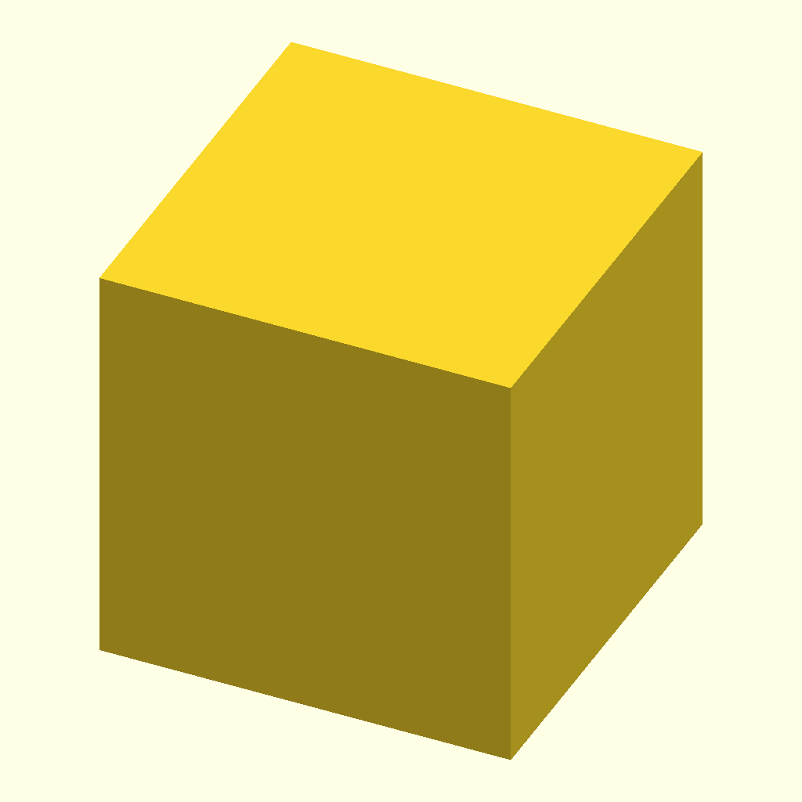

# Slic3r make_tool

Use GNU Make and Slic3r to generate G-Code.

## Usage

- ```git clone https://github.com/jed-frey/slic3r_profiles.git ~/.Slic3r/make_tool```
- Copy ```~/.Slic3r/make_tool/Makefile``` to your folder with STLs.
  - Copy ```~/.Slic3r/make_tool/Makefile.openscad``` to your OpenSCAD project folder
- Run ```make``` in folder with STLs.
- G-code files are in ```build``` directory.

## ```slice_all.sh```

```slice_all.sh``` will slice STLs with all permutations of ```Slic3r``` settings.

## Examples

    cd  ~/.Slic3r/make_tool/examples
    make

1. Generates ```Cube_100x100x100.stl```
1. Generates ```Cube_100x100x100.png```
  
1. Then Slices to ```build/default-0.4-default/Cube_100x100x100-default.gcode```
